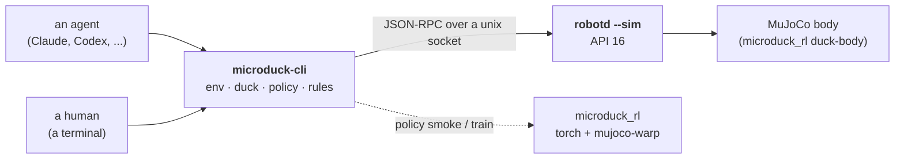

import Tabs from '../../../components/Tabs.astro';
import Note from '../../../components/admonition/Note.astro';
import Info from '../../../components/admonition/Info.astro';
import Tip from '../../../components/admonition/Tip.astro';
import Warning from '../../../components/admonition/Warning.astro';

[MicroDuck](https://github.com/pollen-robotics/microduck) is Pollen Robotics' small bipedal duck robot. Its daemon, `robotd`, speaks JSON-RPC over a unix socket, and its reinforcement-learning stack, [microduck_rl](https://github.com/pollen-robotics/microduck_rl), ships a MuJoCo body plus the training lane that produced the duck's ONNX policies. [microduck-cli](https://github.com/agentculture/microduck-cli) puts one command-line interface in front of both: the same verbs for a human at a terminal and for an AI agent driving the robot, with no robotics SDK and zero runtime dependencies.

This tutorial brings the whole stack up on a Jetson: the real `robotd` daemon driving the MuJoCo duck, the CLI standing it up and making it move, a data-only rules layer reacting at 50 Hz, and, on the boards that can, a short GPU training smoke test of the walking policy.


## What You Will Build

- A running simulation: `robotd --sim` driving the `duck-body` MuJoCo simulator, with a viewer window on your display.
- A standing duck that runs skills, turns its head and reacts to a rule you write in TOML, all through `microduck` verbs.
- A 50 Hz tick engine that owns the control socket and logs every intent it admits or drops.
- On Jetson AGX Thor and DGX Spark: a 64-environment, 5-iteration training smoke test of the `Mjlab-Velocity-Flat-MicroDuck` task on the GPU.

The Spark path was followed end to end on **2026-09-07** with the CLI at version **0.9.4** from PyPI. The Thor and Orin records date from 2026-09-04 and ran earlier checkouts of the CLI (`2b00480` and `3c09fb0`, version 0.9.1); their tabs say so, and their re-run on 0.9.4 is pending. The per-box tabs below say what was verified where, and when.

## Why Jetson?

The duck's control loop, its ONNX policies and the MuJoCo physics all run on one machine. Jetson AGX Thor and DGX Spark carry the unified memory and the Blackwell-class GPU that `mujoco-warp` and `torch` want for training thousands of parallel environments, so the same board that will eventually sit inside a robot can also train the policy it runs. Jetson AGX Orin runs the simulation, the daemon and the CLI comfortably; at the current upstream pins its `sm_87` GPU has no matching `torch` wheel for training, so this tutorial treats Orin as a simulation and control target only.

## Pipeline Overview

<div class="mermaid-diagram">



</div>

| Stage | What happens |
|---|---|
| `env doctor` | Thirteen checks: upstream clones at the pinned commits, Rust toolchain, built daemons, the RL virtual environment with `onnxruntime`, a free simulator port, a short-enough state directory, the host class. |
| `env up --sim` | Builds the daemons if needed, starts `duck-body` and `robotd --sim`, and waits for the duck to report healthy. |
| `duck ...` | Operate one duck in the daemon's own words: `health`, `init`, `enable`, `do`, `look`, `move`, `monitor`, `record`. |
| `rules ...` | The data-only reaction layer and its tick engine. |
| `policy smoke` | The 64-env training smoke test, run through `microduck_rl`'s own `train` entry point. |
| `env down` | Stops exactly the processes `env up` started. |

<Warning title="The duck does not walk at these pins">
At the upstream commits this tutorial pins, `duck move` reaches the daemon and the walk network is selected, but the joint targets it produces are static. The duck leans; it does not take steps. Stand-up, skills, head motion and the rules layer are all verified; locomotion is not. The finding, and everything that was ruled out, is in the [simulation bring-up record](https://github.com/agentculture/microduck-cli/blob/main/docs/verification/2026-09-04-sim-bringup.md) under "Walking in the MuJoCo body". A future re-pin may change this; the CLI's live suite keeps a sentinel test for it.
</Warning>

## Prerequisites

### Hardware and software

| Box | Tested software | What this tutorial covers there |
|---|---|---|
| **DGX Spark** (GB10) | DGX OS, CUDA 13.0, Python 3.12 | Simulation, CLI, training smoke. Verified 2026-09-07 with the viewer window open. |
| **Jetson AGX Thor** | JetPack 7, L4T R38.2.2, CUDA 13.0, Python 3.12 | Simulation, CLI, training smoke (with the torch-source fix described in its tab). Verified 2026-09-04 headless; operator re-run pending. |
| **Jetson AGX Orin** | L4T R39, CUDA 13.2, Python 3.12 | Simulation and CLI only. Verified 2026-09-04 headless; operator re-run pending. |

- **Python 3.12 or newer.** The CLI requires it. The three boxes above ship Python 3.12.3. JetPack 6 ships Python 3.10 and was **not tested**; there, `uv python install 3.12` gives `uv` a managed interpreter for the CLI, but the RL virtual environment (`torch` 2.9.1, `cp312` wheels) is untested on JetPack 6.
- **[uv](https://docs.astral.sh/uv/)** for the CLI install and the RL virtual environment.
- **A Rust toolchain** via [rustup](https://rustup.rs/), to build `robotd` and its sibling daemons natively. The build takes several minutes on a Jetson.
- **git**, and about 10 GB of free disk: roughly 1.5 GB for the `microduck` clone with its debug build and 7.5 GB for `microduck_rl` with its virtual environment (measured on Spark, the heaviest path), plus `uv`'s cache.
- **A display** for the MuJoCo viewer window, or the `--headless` flag if nobody is watching.
- **Free memory for the training smoke:** on Thor, the tutorial proceeds only with at least 20 GB available (see the Thor tab). The simulation alone needs far less.

<Info title="Nothing here drives a physical duck">
Every command in this tutorial was run against the MuJoCo body and the daemon's `--fake` body. The CLI has never driven real hardware. If you do own a MicroDuck: motion is gated, so nothing moves without `--apply`, and `duck relax` drops torque, which makes a real duck fall over.
</Info>

## Step 1: Install the CLI

```bash
uv tool install microduck-cli==0.9.4
microduck --version
```

The install line pins 0.9.4 because that is the wheel this tutorial was followed with on Spark; the Thor and Orin records were made from earlier checkouts (see their tabs). `microduck` and `microduck-cli` are the same entry point. Agents start with `microduck learn`, which prints the command map, the exit-code contract and the `--json` output contract; `microduck explain <noun> <verb>` describes any single verb.

## Step 2: Clone the upstream repositories at the pinned commits

The CLI implements upstream's documented commands and wire protocol; it does not bundle upstream code. Two sibling clones are needed, at the exact commits the CLI was validated against ([`docs/upstream-pins.md`](https://github.com/agentculture/microduck-cli/blob/main/docs/upstream-pins.md)):

| Repository | Branch | Commit |
|---|---|---|
| [pollen-robotics/microduck](https://github.com/pollen-robotics/microduck) | `sim-remote-io` | `0cd676d6fbb6e90a762c84aa63abe7a02dbc9495` |
| [pollen-robotics/microduck_rl](https://github.com/pollen-robotics/microduck_rl) | `develop` | `29e887ecfbf5d37144759e5a9f8a176dfb83d547` |

The `sim-remote-io` branch is the only one carrying `robotd --sim` and `robotd --fake`; `main` has no simulator backend.

```bash nocheck
mkdir -p ~/git && cd ~/git
git clone https://github.com/pollen-robotics/microduck.git
git -C microduck checkout 0cd676d6fbb6e90a762c84aa63abe7a02dbc9495
git clone https://github.com/pollen-robotics/microduck_rl.git
git -C microduck_rl checkout 29e887ecfbf5d37144759e5a9f8a176dfb83d547
```

<Note title="Where the CLI looks for the clones">
`microduck` resolves the clones from `MICRODUCK_CLONE` and `DUCK_SIM_RL`, defaulting to `../microduck` and `../microduck_rl` relative to its own checkout. On a `uv tool` install, export the two variables:

```bash
export MICRODUCK_CLONE=~/git/microduck
export DUCK_SIM_RL=~/git/microduck_rl
```

Sockets, pidfiles and engine state live under `DUCK_SIM_STATE`, default `~/.cache/duck-sim`. You never type a socket path.
</Note>

## Step 3: Build the daemons

```bash nocheck
curl --proto '=https' --tlsv1.2 -sSf https://sh.rustup.rs | sh
source ~/.cargo/env
cd ~/git/microduck
cargo build -p robotd -p robotctl -p tof -p sounds
```

<Tip title="cargo must be on PATH for the checks">
`env doctor` only sees `cargo` when rustup's `~/.cargo/bin` is on `PATH`. A non-login shell, and most SSH sessions, do not get that for free. Run `source ~/.cargo/env` in every new shell before the doctor, or add it to your shell profile.
</Tip>

## Step 4: Create the RL virtual environment

`robotd` loads the duck's ONNX policies through `onnxruntime` from the `microduck_rl` virtual environment, even for the `--fake` body, so this step is required for every path. How `torch` is sourced differs per box; pick your tab.

<Tabs labels={["DGX Spark", "Jetson AGX Thor", "Jetson AGX Orin"]}>
<div class="nv-tab-panel active">

<Info title="Verified 2026-09-07, viewer window open">
DGX Spark (GB10) is the host class `microduck_rl`'s torch routing was written for. Upstream's configuration works as shipped.
</Info>

```bash nocheck
cd ~/git/microduck_rl
uv sync
```

`uv sync` resolves `torch` 2.9.1 from PyTorch's CUDA index for `linux-aarch64`, plus `warp-lang`, `mujoco` and `mujoco-warp`. Nothing else to do.

</div>
<div class="nv-tab-panel">

<Info title="Verified 2026-09-04 (headless); operator re-run pending">
The same commands will be re-run on Thor with the viewer window open, on the 0.9.4 wheel; this tab will be updated with that record.
</Info>

<Warning title="Thor training needs a torch-source fix that is not merged upstream yet">
At the pinned commit, `microduck_rl` routes `torch` to a CUDA 12.9 index on every `linux-aarch64` host. That predates Thor's GPU. The fix routes Jetson boards to NVIDIA's `sbsa/cu130` index and adds three wheels the SBSA `torch` links but does not declare. It is open as [pollen-robotics/microduck_rl#39](https://github.com/pollen-robotics/microduck_rl/pull/39) (issue [#38](https://github.com/pollen-robotics/microduck_rl/issues/38)). Until it merges, point the `microduck_rl` clone you made in Step 2 at the pull request's branch instead of the pinned `develop` commit. `env doctor` will then report `rl_pinned_commit` as a mismatch on Thor; that is expected. On a `uv tool` install the two pin checks read `[FAIL] … unknown` anyway (see the note in Step 5), so read the doctor's verdict line, not the count of `[FAIL]` prefixes.
</Warning>

```bash nocheck
cd ~/git/microduck_rl
git fetch https://github.com/OriNachum/microduck_rl.git fix/jetson-thor-torch-source
git checkout a30a9e4
UV_HTTP_TIMEOUT=600 uv sync
```

`a30a9e4` is the pull request's head at the time of writing; `git -C ~/git/microduck_rl log --oneline -1` should name it.

With that branch, `torch` 2.9.1 arrives as a native `linux_aarch64` wheel from `pypi.jetson-ai-lab.io/sbsa/cu130`, and no `LD_LIBRARY_PATH` is needed. The [Thor record](https://github.com/agentculture/microduck-cli/blob/main/docs/verification/2026-09-04-thor-sanity.md) shows the resolution and a CUDA probe on Thor.

</div>
<div class="nv-tab-panel">

<Info title="Verified 2026-09-04 (headless); operator re-run pending">
Simulation, daemon, CLI and rules layer all pass on Orin. This tab covers those. It contains no training command.
</Info>

<Warning title="GPU training is not available on AGX Orin at these pins">
The only `torch` 2.9.1 wheel for Python 3.12 on the Jetson indexes ships kernels for `sm_110` and `sm_121`, not Orin's `sm_87`. It installs and initialises CUDA, then fails with "no kernel image is available for execution on the device". The fallback tree was probed and is closed at this pin; the [Orin record](https://github.com/agentculture/microduck-cli/blob/main/docs/verification/2026-09-04-orin-sanity.md) has the details. `env doctor` says so on its `host_class` line. Train on Thor, Spark or Hugging Face Jobs instead.
</Warning>

You still need the virtual environment for `onnxruntime`, which `robotd` loads for the policies:

```bash nocheck
cd ~/git/microduck_rl
UV_INDEX="pytorch-cu129=https://pypi.jetson-ai-lab.io/sbsa/cu130" uv sync
```

`torch` 2.9.1 is a direct dependency, so it still installs; the `UV_INDEX` override picks NVIDIA's SBSA wheel (which installs and initialises CUDA but has no `sm_87` kernels) instead of PyTorch's `cu129` build, and `onnxruntime`, `mujoco` and the rest resolve normally. Any later bare `uv run` inside the clone re-locks toward upstream's index and starts a multi-gigabyte re-download, so prefix `uv` calls there with the same variable. `env up` does not go through `uv` (it runs the virtual environment's Python directly), but every `policy` verb does run `uv run` in the clone — another reason the Orin path stops before Step 10.

</div>
</Tabs>

## Step 5: Ask the doctor

```bash
microduck env doctor
```

Thirteen checks, each with a remediation when it fails. A healthy box prints:

```text
microduck-cli env doctor: healthy
```

The doctor exits `2` and names every failing check when the box is not ready. Do not proceed on a `2`. A pin mismatch is only a warning, so Thor on the pull-request branch still gets a `healthy` verdict; it is the verdict line that matters (see the Thor tab and the note below).

<Note title="Two [FAIL] lines under a healthy verdict on a uv tool install">
With the CLI installed from PyPI (Step 1), version 0.9.4 prints `[FAIL] microduck_pinned_commit: pinned commit for microduck is unknown (docs/upstream-pins.md unreadable or the row is missing)` and the same for `rl_pinned_commit`, while the first line still says `healthy` and the exit code is `0`. The wheel does not carry the pins file the check reads; the check is a warning, so the verdict is right and the `[FAIL]` prefix is misleading. Compare the commits yourself with `git -C ~/git/microduck rev-parse HEAD` against the table in Step 2. A fix that ships the pins inside the package is tracked in the CLI repository.
</Note>

## Step 6: Bring the simulation up

```bash
microduck env up --sim
```

`--sim` starts the real `duck-body` MuJoCo simulator behind `robotd --sim` and waits up to 120 seconds for the duck to report healthy. A viewer window appears on your display. Two variants, the first the same body with no window, the second `robotd --fake` with no physics and no window:

```bash
microduck env up --sim --headless
microduck env up --fake
```

`env up` runs the cargo build itself when the daemons are missing or stale, and returns in a moment when nothing changed, so there is no flag to remember.

<Note title="Driving from an SSH session">
The viewer opens on the box's own graphical session, not in your terminal. When you run `env up --sim` over SSH, export the desktop session's `DISPLAY` and `XAUTHORITY` into your shell first (read them from the environment of the logged-in session's `gnome-shell` process), or use `--headless`.
</Note>

<Warning title="Keep the desktop session unlocked while the window is open">
On the Spark run the desktop locked itself after five idle minutes and the simulator body exited with its window: `robotd` kept running and logging `bus write failed ... Connection refused`, and `duck monitor` never returned. Unlock the session before `env up --sim` and turn off automatic locking for the run (`gsettings set org.gnome.desktop.session idle-delay 0`, then restore it), or use `--headless`.
</Warning>

`env up` returns as soon as the daemon answers `healthy`, which can be within two seconds, before the body has finished its first frames: `duck health` right after it may still show `imu: not ready` and `achieved None`. Give it a few seconds; the second reading shows `imu: ready` and the loop at 50 Hz.

## Step 7: Stand the duck up

```bash
microduck duck health
microduck duck init --apply
microduck duck enable --apply
```

`health` is the robot's own verdict: loop rate, bus, IMU. It exits `2` when the robot is unhealthy. `init` powers the joints and ramps to the home pose, which takes about eight seconds; `enable` hands the robot to its policy, and it holds a standing stance. Watch it:

```bash
microduck duck monitor --frames 5 --json
```

Each frame is one JSON object. After `enable` you should see `"policy": "stand"`, `"fallen": false` and a trunk height `z` near `0.118`, with the control loop at 50 Hz and zero missed ticks. That reading came out identical to four decimals on Spark, Thor and Orin.


<Warning title="What --apply means">
Every verb that moves the robot goes through one gate. On a terminal it asks you to confirm. On a pipe without `--apply` it prints a zero-side-effect dry-run plan and sends nothing. On a pipe with `--apply` it proceeds; that is agent mode. A command that printed a plan did not move the duck.
</Warning>

<Warning title="Never relax a duck you want standing">
`duck relax` drops torque on every joint. In simulation the duck collapses; a real duck falls. The tick engine in Step 9 deliberately never sends it, even on an abnormal exit.
</Warning>

## Step 8: Make it do things

Turn the head toward a point in the trunk frame. Pick a visibly large target; small offsets read as nothing happened:

```bash
microduck duck look --x 0.2 --y 0.4 --z -0.1 --apply
```

Run one of the daemon's one-shot skills. Never guess a skill name; ask the live daemon what it has, then run one:

```bash
microduck policy list --duck duck-a
microduck duck do roulade --apply
```

`policy list --duck` prints the daemon's `## skills` section (`ground_pick`, `kick_left`, `kick_right`, `roulade`, `sitstand` on this daemon); `duck do` accepts the CLI's fixed spelling of those (`ground-pick`, `kick-left`, `kick-right`, `roulade`, `sit`), which `microduck duck do --help` lists.

Send a velocity for a few seconds, then stop (remember the warning at the top: at these pins the duck leans rather than walks):

```bash
microduck duck move --vx 0.15 --duration 3 --apply
```

Let it speak, and record what it senses as pure JSONL on stdout:

```bash
microduck duck quack
microduck duck record --seconds 5 > senses.jsonl
```

`record` writes one JSON object per line to stdout and every diagnostic to stderr, so the file stays pure JSONL. In simulation two stderr lines are expected: `dropped reason=record-source-absent` for the pad and for the ToF daemon, neither of which exists in the sim. Five seconds gave 174 records on Spark.

## Step 9: React with rules, not code

The rules layer is data. A rule names a condition on the duck's sense snapshot and an intent to fire, with a cooldown and a duration. Save this as `my-rules.toml`:

```toml
schema_version = 1

[[react]]
id = "verify-look"
when = { field = "fallen", op = "is_false" }
run = "look"
params = { x = 0.5, y = 0.0, z = 0.1 }
cooldown_s = 5.0
duration_s = 2.0
```

Check it against the live daemon, then run the tick engine for 300 ticks (six seconds at 50 Hz):

```bash
microduck rules check --rules ./my-rules.toml --duck duck-a
microduck rules engine run --duck duck-a --rules ./my-rules.toml --apply --max-ticks 300 --json
```

The engine is the one long-running process on the duck's control socket; the one-shot `duck` verbs above share the same socket and nothing stops you from mixing them, so do not drive by hand while an engine is live. It logs its start sequence on stderr (connect, hello, health, init, enable, armed), then every rule firing and every drop with a named reason:

```text
[SENSE stage=start source=~/.cache/duck-sim/duck-a.sock event=connect] opening the robot control socket
[SENSE stage=start source=~/.cache/duck-sim/duck-a.sock event=hello] daemon api_version=16
[SENSE stage=start source=~/.cache/duck-sim/duck-a.sock event=health] healthy
[SENSE stage=start source=~/.cache/duck-sim/duck-a.sock event=init] robot.init
[SENSE stage=start source=~/.cache/duck-sim/duck-a.sock event=enable] enabled — driving
[SENSE stage=start source=~/.cache/duck-sim/duck-a.sock event=armed] 4 rule(s) loaded, idle registered
[SENSE stage=rule source=verify-look event=fired] look -> look-1
[SENSE stage=rule source=verify-look event=cooldown] dropped reason=cooldown: fired 0.020s ago, cooldown_s is 5.0
```

The JSON on stdout ends with the run's metrics; on Spark, 300 ticks at `"achieved_hz": 49.998` with `"overruns": 0` and a mean tick of 0.3 ms. The stderr log had 747 lines for those six seconds: two firings, 210 cooldown drops and 528 `inhibits` drops from the shipped rules, each with its reason.

A rule that fires and a human typing an intent are judged by the same admission registry. With no engine live, this validates the intent and prints its verdict (`intent stop: admitted`), sending nothing:

```bash
microduck rules intent stop
```

<details class="nv-details">
<summary>Why one process owns the socket</summary>
<div class="nv-details-content">

`robotd` arbitrates nothing between clients. Two processes writing to the same duck are two authors fighting over every channel. So senses, rules, arbitration and the composed pose all ride one 50 Hz tick in one process, and while a human is driving with the pad the engine withholds every motion channel it composed. If the duck seems to ignore the engine, check whether a pad is live first.

</div>
</details>

## Step 10: Train (Spark and Thor)

`policy smoke` runs `microduck_rl`'s own trainer on the `Mjlab-Velocity-Flat-MicroDuck` task with 64 environments for 5 iterations. It proves the GPU path end to end and records a smoke-gate entry that the long-running `policy train` verb refuses to proceed without.

<Tabs labels={["DGX Spark", "Jetson AGX Thor", "Jetson AGX Orin"]}>
<div class="nv-tab-panel active">

```bash
WANDB_MODE=offline microduck policy smoke Mjlab-Velocity-Flat-MicroDuck --json
```

On the GB10 the smoke completed in about a minute on a cold kernel cache (`real 0m58.6s` in the [first Spark record](https://github.com/agentculture/microduck-cli/blob/main/docs/verification/2026-09-04-sim-bringup.md)) and in 16 seconds on a warm one (the [2026-09-07 re-test](https://github.com/agentculture/microduck-cli/blob/main/docs/verification/2026-09-07-spark-retest.md)), with `ok: true` in the JSON payload.

<Warning title="The GPU must actually be free">
Spark's memory is unified. If another process holds the device memory (a resident LLM server, say), the smoke fails within ten seconds even while `free -g` still shows headroom: Warp prints `"NVIDIA GB10" (0 GiB, sm_121, ...)`, then `Warp CUDA error 2: out of memory` and `torch.AcceleratorError: CUDA error: out of memory`, and the payload says `ok: false`. That is exactly what happened on the 2026-09-07 re-test beside a running vLLM engine; stopping that one engine for the smoke made Warp see 122 GiB and the run pass. Check what is using the GPU before you read the failure as anything else.
</Warning>

</div>
<div class="nv-tab-panel">

Thor shares its memory between the CPU and the GPU, and the smoke compiles every `mujoco-warp` kernel on a cold cache. Check headroom first and proceed only with at least 20 GB available:

```bash
free -g
```

```bash
WANDB_MODE=offline timeout 30m microduck policy smoke Mjlab-Velocity-Flat-MicroDuck --json
```

The [Thor record](https://github.com/agentculture/microduck-cli/blob/main/docs/verification/2026-09-04-thor-sanity.md) shows `ok: true` after 144 seconds; the extra time over Spark is first-run kernel compilation (one kernel alone took 25 seconds). If the box also runs other services, confirm they are still healthy afterwards:

```bash nocheck
docker ps
```

</div>
<div class="nv-tab-panel">

<Warning title="No training step on Orin">
There is no `torch` wheel with `sm_87` kernels at these pins, so `policy smoke` fails on AGX Orin with "no kernel image is available". Everything up to Step 9 works; run the smoke on Thor, Spark or Hugging Face Jobs.
</Warning>

</div>
</Tabs>

## Step 11: Tear it down

```bash
microduck env down
microduck env status
```

`env down` stops every process `env up` started, by pidfile and only after confirming the pid still names the binary it was written for. Never kill the daemons by name. `env status` afterwards should show nothing tracked alive.

## Watching the window from a headless session

The viewer lives on the box's graphical session. To capture it from SSH, export the logged-in session's display variables and take a shot of the focused window only:

```bash nocheck
export DISPLAY=<the session's display>
export XAUTHORITY=<the session's X authority file>
export DBUS_SESSION_BUS_ADDRESS=<the session's bus address>
gnome-screenshot -w -f duck.png
```

Two shots a few seconds apart are the honest way to tell motion from a static pose; that is how the no-gait finding above was made.

## Troubleshooting

<details class="nv-details">
<summary>env doctor: cargo_version: cargo not found</summary>
<div class="nv-details-content">

Your shell does not have `~/.cargo/bin` on `PATH`. Run `source ~/.cargo/env` and try again.

</div>
</details>

<details class="nv-details">
<summary>env up --fake exits 2: no onnxruntime shared object under microduck_rl/.venv</summary>
<div class="nv-details-content">

The `--fake` body is not venv-free. `robotd` loads `libonnxruntime` from the RL virtual environment for the policies even without physics. Finish Step 4.

</div>
</details>

<details class="nv-details">
<summary>env doctor on Thor: rl_pinned_commit fails</summary>
<div class="nv-details-content">

Expected while the `microduck_rl` clone is on the pull-request branch from the Thor tab; on a `uv tool` install `microduck_pinned_commit` prints a `[FAIL] … unknown` line as well (Step 5's note). Both are warnings and the verdict stays `healthy`. It clears when [#39](https://github.com/pollen-robotics/microduck_rl/pull/39) merges and the CLI re-pins.

</div>
</details>

<details class="nv-details">
<summary>The duck ignores duck move</summary>
<div class="nv-details-content">

It is not ignoring you. At these pins the walk network's joint targets are static: the twist is applied, `policy` reads `walk`, and the duck leans without stepping. See the warning at the top of this page.

</div>
</details>

<details class="nv-details">
<summary>No window appears with env up --sim</summary>
<div class="nv-details-content">

The body cannot open a window without a display. Over SSH, export the desktop session's `DISPLAY` and `XAUTHORITY` (see "Watching the window from a headless session"), or add `--headless` and use `duck monitor --json` instead. `xwininfo -root -tree | grep -i mujoco` on that display lists the viewer window when it exists.

</div>
</details>

<details class="nv-details">
<summary>duck monitor hangs, robotd logs "bus write failed ... Connection refused"</summary>
<div class="nv-details-content">

The simulator body is gone while the daemon is still up. On a desktop that locks itself, the lock closes the viewer window and the body exits with it. Run `microduck env down`, unlock the session, disable automatic locking for the run, and bring the stack up again. `env down` reports the body as `gone` with `no /proc entry` in this case, which is the confirmation.

</div>
</details>

<details class="nv-details">
<summary>policy smoke fails with "CUDA error: out of memory" in seconds</summary>
<div class="nv-details-content">

Something else holds the GPU. On unified-memory boxes `free -g` does not tell you; Warp's banner does (`0 GiB`). Stop or pause the other GPU tenant for the duration of the smoke, confirm it is healthy again afterwards, and note both in your own record.

</div>
</details>

## Next Steps

- `microduck learn` and `microduck explain <noun> <verb>` are the CLI's own reference, written for agents first.
- The CLI's [operating walkthrough](https://github.com/agentculture/microduck-cli/blob/main/docs/operating-the-duck.md) covers the six core commands with each one's output.
- [Reachy Mini Jetson Assistant](/tutorials/reachy-mini-jetson-assistant): another Pollen Robotics robot on Jetson, this one with a local VLM in the loop.

## References

- [microduck-cli](https://github.com/agentculture/microduck-cli) and its verification records for [DGX Spark](https://github.com/agentculture/microduck-cli/blob/main/docs/verification/2026-09-04-sim-bringup.md) (and the [2026-09-07 re-test that followed this tutorial](https://github.com/agentculture/microduck-cli/blob/main/docs/verification/2026-09-07-spark-retest.md)), [Jetson AGX Thor](https://github.com/agentculture/microduck-cli/blob/main/docs/verification/2026-09-04-thor-sanity.md) and [Jetson AGX Orin](https://github.com/agentculture/microduck-cli/blob/main/docs/verification/2026-09-04-orin-sanity.md)
- [pollen-robotics/microduck](https://github.com/pollen-robotics/microduck), branch `sim-remote-io`, and its [simulation design notes](https://github.com/pollen-robotics/microduck/blob/sim-remote-io/docs/design/simulation.md)
- [pollen-robotics/microduck_rl](https://github.com/pollen-robotics/microduck_rl), branch `develop`
- [microduck_rl#39](https://github.com/pollen-robotics/microduck_rl/pull/39): Jetson torch-source fix
- [MuJoCo](https://mujoco.org/) and [mujoco-warp](https://github.com/google-deepmind/mujoco_warp)
- [NVIDIA Jetson PyPI index](https://pypi.jetson-ai-lab.io/)
