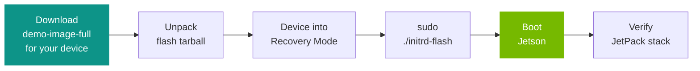

import Tabs from '../../../components/Tabs.astro';

# Quick Start Guide with Yocto

The standard way to set up a Jetson is the JetPack flow: you flash Jetson Linux (Ubuntu) from an ISO USB stick, following the [Quick Start Guide for your developer kit](/tutorials/getting-started-with-jetson/). JetPack delivers NVIDIA's complete, validated software stack and is an excellent choice for both development and production.

The [Yocto Project](https://www.yoctoproject.org/) is an **alternative** option for teams who prefer to build their own Linux image with the OpenEmbedded build system, choosing exactly which packages are included, integrating the OS build into CI, and reproducing the same image from source on every build. It uses the same Jetson Linux (L4T) and JetPack components under the hood. This guide shows how to get started with the Yocto path on Jetson.

Beginning with **JetPack 7.2 (Jetson Linux R39.2)**, Yocto is an officially supported path on Jetson, developed together with the community [OpenEmbedded for Tegra (OE4T)](https://github.com/OE4T) project. The Jetson Yocto recipes live in two OE4T repositories:

- **`meta-tegra`** (the Jetson BSP layer) - GitHub: [github.com/OE4T/meta-tegra](https://github.com/OE4T/meta-tegra)
- **`tegra-demo-distro`** (ready-to-use reference images) - GitHub: [github.com/OE4T/tegra-demo-distro](https://github.com/OE4T/tegra-demo-distro)

You don't have to build anything to try it. In this guide you'll **download a prebuilt `demo-image-full` image and flash it** to your Jetson. `demo-image-full` is a desktop (Sato/X11) image that already includes `nvidia-docker` and the Multimedia API samples, a good way to see what a Yocto-based Jetson image looks like. It comes from the OE4T [`tegra-demo-distro` `wrynose` branch](https://github.com/OE4T/tegra-demo-distro/tree/wrynose).

<div class="admonition note">
  <p class="admonition-title">📘 Where to get the images</p>
  <p>Prebuilt Yocto images are published on the <a href="https://developer.nvidia.com/embedded/jetpack/downloads" target="_blank" rel="noopener">JetPack SDK downloads page</a>. Under <strong>Yocto Images</strong>, use the button for your device: <strong>Yocto for Jetson AGX Thor</strong>, <strong>Yocto for Jetson AGX Orin</strong>, or <strong>Yocto for Jetson Orin Nano</strong>. If you'd rather build the image yourself, jump to <a href="#build-your-own-yocto-image">Build your own Yocto image</a>.</p>
</div>

## Supported images

Download the `demo-image-full` tegraflash tarball for your target. Use the tarball whose `MACHINE` name matches your hardware. **Do not** use a tarball built for a different Jetson module or carrier.

| Hardware | OE4T `MACHINE` | Tarball name | Rootfs target |
|----------|----------------|--------------|---------------|
| Jetson AGX Thor devkit | `jetson-agx-thor-devkit` | `demo-image-full-jetson-agx-thor-devkit.rootfs.tegraflash-tar.zst` | NVMe (`nvme0n1p1`) |
| Jetson AGX Orin devkit (64 GB) | `p3737-0000-p3701-0005` | `demo-image-full-p3737-0000-p3701-0005.rootfs.tegraflash-tar.zst` | internal eMMC (`mmcblk0p1`) |
| Jetson Orin Nano (NVMe) | `jetson-orin-nano-devkit-nvme` | `demo-image-full-jetson-orin-nano-devkit-nvme.rootfs.tegraflash-tar.zst` | NVMe (`nvme0n1p1`) |

<div class="admonition warning">
  <p class="admonition-title">⚠️ Install the NVMe drive first (NVMe targets)</p>
  <p>For the two NVMe targets (AGX Thor and Orin Nano), <strong>install the NVMe drive in the Jetson before</strong> putting the device into recovery mode. The flash script writes the root filesystem to the storage target described by the <code>MACHINE</code> configuration.</p>
</div>

## Why Yocto?

The Yocto Project is not a Linux distribution by itself. It is a **build framework** that produces a distribution tailored to your hardware, package set, and update model. Teams reach for Yocto on Jetson when they need tight control over the OS image that ships in a **product**: a minimized package set, reproducible builds in CI, Secure Boot, OTA updates, package feeds, and long-term maintenance. For this getting-started guide, you simply consume a prebuilt image, so no build framework knowledge is required.

<div class="admonition tip">
  <p class="admonition-title">💡 Just want to run AI workloads?</p>
  <p>If you're not specifically interested in Yocto and just want to get models running quickly, the standard JetPack flow in <a href="/tutorials/getting-started-with-jetson/">Getting Started with Jetson</a> is the easier path.</p>
</div>

The end-to-end flow for this guide is short:

<div class="mermaid-diagram">



</div>

## What's in `demo-image-full`?

The `tegrademo` distro from OE4T ships several reference image recipes. `demo-image-full` is the most complete one:

| Image | Contents |
|-------|----------|
| `demo-image-base` | Basic image, no graphics |
| `demo-image-egl` | DRM/EGL graphics, no window manager |
| `demo-image-sato` | X11 image with the Sato UI |
| `demo-image-weston` | Wayland with the Weston compositor |
| **`demo-image-full`** | **Sato UI plus `nvidia-docker` and Multimedia API samples** |

## Prerequisites

### Host machine

Use a **native x86-64 Ubuntu 24.04 host**. Avoid flashing from a virtual machine, container, WSL environment, or through an external USB hub. The low-level USB recovery protocol is sensitive to host USB behavior.

Install the host packages needed by the OE4T flash scripts:

```bash
sudo apt update
sudo apt install \
  bash \
  bmap-tools \
  cpp \
  device-tree-compiler \
  gdisk \
  libxml2-utils \
  python3 \
  tar \
  udisks2 \
  usbutils \
  zstd
```

If you want to monitor a serial console, also install a serial terminal and add your user to the `dialout` group (log out and back in afterward):

```bash
sudo apt install picocom
sudo usermod -aG dialout "$USER"
```

### Prepare the desktop host

On an Ubuntu 24.04 **desktop** host, disable automatic mounting of removable media before flashing. The Orin flashing flow exposes storage over USB, and desktop automount can interfere with it:

```bash
gsettings set org.gnome.desktop.media-handling automount false
gsettings set org.gnome.desktop.media-handling automount-open false
```

Verify that both commands print `false`:

```bash
gsettings get org.gnome.desktop.media-handling automount
gsettings get org.gnome.desktop.media-handling automount-open
```

<div class="admonition note">
  <p class="admonition-title">📘 Notes</p>
  <p>If <code>gsettings</code> is unavailable (a non-desktop host), this automount step does not apply. If the host has the <code>tlp</code> power-management package installed, remove it and reboot the host before flashing: <code>sudo apt remove tlp && sudo reboot</code>.</p>
</div>

## Step 1: Download the image for your device

From the [JetPack downloads page](https://developer.nvidia.com/embedded/jetpack/downloads) (JetPack 7.2 / Jetson Linux R39.2), under **Yocto Images**, click the button for your device: **Yocto for Jetson AGX Thor**, **Yocto for Jetson AGX Orin**, or **Yocto for Jetson Orin Nano**. Download the `.tegraflash-tar.zst` package whose `MACHINE` matches your hardware (see the [Supported images](#supported-images) table). Save it to `~/Downloads` and **leave the filename unchanged**.

## Step 2: Unpack the flash tarball

Set `MACHINE` to your target, then unpack the tarball into a fresh directory. Use the value from the table that matches your hardware:

<Tabs labels={["Thor AGX devkit", "Orin AGX 64 GB", "Orin Nano (NVMe)"]}>
  <div class="nv-tab-panel active">
    <pre style="background: #1e293b; color: #e2e8f0; padding: 1rem; border-radius: 8px;"><code>{"export MACHINE=\"jetson-agx-thor-devkit\""}</code></pre>
  </div>
  <div class="nv-tab-panel">
    <pre style="background: #1e293b; color: #e2e8f0; padding: 1rem; border-radius: 8px;"><code>{"export MACHINE=\"p3737-0000-p3701-0005\""}</code></pre>
  </div>
  <div class="nv-tab-panel">
    <pre style="background: #1e293b; color: #e2e8f0; padding: 1rem; border-radius: 8px;"><code>{"export MACHINE=\"jetson-orin-nano-devkit-nvme\""}</code></pre>
  </div>
</Tabs>

Then unpack:

```bash
mkdir -p ~/jetson-flash
cd ~/jetson-flash
tar xf ~/Downloads/demo-image-full-${MACHINE}.rootfs.tegraflash-tar.zst
```

<div class="admonition tip">
  <p class="admonition-title">💡 Tip</p>
  <p>Use a fresh empty directory if you unpack more than one target so the contents don't mix.</p>
</div>

## Step 3: Put the Jetson in Recovery Mode

Connect the host to the Jetson's **recovery USB port** before running the flash script. The exact port differs per developer kit. The **Diagram** links open the official Hardware Layout page with annotated photos of the USB port, RECOVERY/RESET buttons, and recovery header.

| Developer kit | Recovery USB port | Diagram |
|---------------|-------------------|---------|
| Jetson AGX Thor devkit | USB-C port with Force-Recovery functionality (**`5a`**, next to the HDMI connector); use the other USB-C port (`5b`) for power | [Hardware Layout](https://docs.nvidia.com/jetson/agx-thor-devkit/user-guide/latest/hardware_layout.html) |
| Jetson AGX Orin devkit (64 GB) | USB Type-C port **next to the 40-pin header** | [Hardware Layout](https://docs.nvidia.com/jetson/agx-orin-devkit/user-guide/latest/hardware_layout.html) |
| Jetson Orin Nano devkit | USB-C port (**mark 4**) | [Hardware Layout](https://docs.nvidia.com/jetson/orin-nano-devkit/user-guide/latest/hardware_layout.html) |

Enter Force Recovery Mode using the sequence for your developer kit:

<Tabs labels={["Thor / Orin AGX (buttons)", "Orin Nano (header pins)"]}>
  <div class="nv-tab-panel active">
    <p>For kits with <strong>RECOVERY</strong> and <strong>RESET</strong> buttons (Thor AGX devkit, Orin AGX devkit):</p>
    <ol>
      <li>Power the Jetson carrier board.</li>
      <li><strong>Hold</strong> the <strong>RECOVERY</strong> (Force Recovery) button.</li>
      <li><strong>Press and release</strong> <strong>RESET</strong>.</li>
      <li><strong>Release</strong> the RECOVERY button.</li>
    </ol>
  </div>
  <div class="nv-tab-panel">
    <p>For the <strong>Jetson Orin Nano</strong> developer kit, use the recovery pins on the <strong>J14</strong> button header (located below the Jetson module):</p>
    <ol>
      <li>Power off the developer kit and disconnect power.</li>
      <li>Place a jumper across <strong>pin 9 (GND)</strong> and <strong>pin 10 (FORCE_RECOVERY)</strong> of the J14 header.</li>
      <li>Reconnect power (or press the power button).</li>
      <li>Wait a couple of seconds, then remove the jumper.</li>
    </ol>
    <p>See <a href="https://docs.nvidia.com/jetson/orin-nano-devkit/user-guide/latest/howto.html#force-recovery-mode" target="_blank" rel="noopener">Orin Nano Developer Kit: Force Recovery Mode</a> for the official steps.</p>
  </div>
</Tabs>

Confirm the host can see an NVIDIA recovery-mode USB device:

```bash
lsusb -d 0955:
```

The output should include an **`APX`** device, which indicates the Jetson is in recovery mode.

<div class="admonition warning">
  <p class="admonition-title">⚠️ APX vs Tegra On-Platform Operator</p>
  <p>A <code>Tegra On-Platform Operator</code> device is the USB serial support interface, <strong>not</strong> the recovery-mode device used for flashing. If <code>APX</code> is missing, check the cable, the recovery USB port, and the recovery-mode button/pin sequence.</p>
</div>

## Step 4: Flash the image

From the directory where you unpacked the tarball, run:

```bash
sudo ./initrd-flash
```

The script detects the Jetson in recovery mode, prepares the flash content, and writes the image. By default it flashes **both** the boot firmware and the configured root filesystem target for the selected `MACHINE`.

<div class="admonition note">
  <p class="admonition-title">📘 If you see <code>could not retrieve board information</code></p>
  <p>If the flash fails early with an error like:</p>
  <pre style="background: #1e293b; color: #e2e8f0; padding: 1rem; border-radius: 8px;"><code>{"Found Jetson device in recovery mode at USB 3-1\nERR: could not retrieve board information"}</code></pre>
  <p><strong>Power-cycle the developer kit</strong> (unplug power, plug it back in), re-enter Force Recovery Mode from power-off, confirm <code>APX</code> appears in <code>lsusb -d 0955:</code>, and run <code>sudo ./initrd-flash</code> again.</p>
</div>

<div class="admonition warning">
  <p class="admonition-title">⏳ Don't disconnect during flashing</p>
  <p>Flashing can take several minutes, particularly the final step that writes the QSPI flash. Keep the USB cable connected and the board powered until it completes. The script writes a host log named <code>log.initrd-flash.YYYY-MM-DD-HH.MM.SS</code>; for Orin targets, device-side logs may also be collected into a <code>device-logs-YYYY-MM-DD-HH.MM.SS</code> directory.</p>
</div>

When flashing completes, bring the device up:

| Target | Next step |
|--------|-----------|
| Thor AGX devkit | Power cycle or reset the Jetson. |
| Orin AGX devkit (64 GB) | The script waits for final device status. Reboot or power cycle if it does not boot automatically. |
| Orin Nano (NVMe) | The script waits for final device status. Reboot or power cycle if it does not boot automatically. |

On boot you'll reach a login prompt. Log in as **`root`** (the demo image has no password set by default).

<div class="admonition warning">
  <p class="admonition-title">⚠️ Change the default login</p>
  <p>The <code>tegrademo</code> image is a <strong>reference / demo</strong> image with passwordless root for convenience. Before using it or any derivative beyond evaluation, set passwords, remove debug tweaks, and review the security configuration.</p>
</div>

## Step 5: Verify the JetPack stack

Once booted, confirm the JetPack components bundled in `demo-image-full` are present. Run these on the device (over serial or SSH):

**Check the L4T / JetPack release:**

```bash
cat /etc/nv_tegra_release
```

**Verify Docker with the NVIDIA runtime:**

```bash
docker info | grep -i runtime
docker run --rm --runtime nvidia hello-world
```

If these respond, your Yocto image is up and the JetPack stack is functional. You now have a Sato desktop running on your Jetson with containers and the multimedia samples ready to use.

## Step 6: Set up persistent storage for Docker containers

<details class="nv-details">
<summary><strong>Expand: set up persistent storage for Docker containers</strong></summary>
<div class="nv-details-content">

The reference image uses an A/B root filesystem layout so the inactive slot remains available for system updates. As a result, the mounted root filesystem is intentionally smaller than the physical drive: approximately 25 GB on AGX Thor and 14 GB on AGX Orin or Orin Nano. Large container images and model caches can fill it quickly.

Before downloading AI containers, create a separate data partition from the unallocated space left after the A/B slots, mount it at `/data`, and place both Docker and containerd storage there. These instructions apply to a **freshly flashed** image with no container data to migrate.

<div class="admonition note">
  <p class="admonition-title">📘 AGX Orin: use an external SSD for vLLM</p>
  <p>The unused portion of the 64 GB AGX Orin eMMC provides approximately 28 GB after formatting. This is useful for smaller containers and model caches, but the current NVIDIA AI-IOT vLLM image expands beyond that capacity. For vLLM on AGX Orin, install an NVMe SSD or connect a USB SSD and use that device for <code>/data</code> instead of creating the eMMC data partition below.</p>
</div>

<div class="admonition warning">
  <p class="admonition-title">⚠️ Confirm the free space before changing the partition table</p>
  <p>The following procedure creates a partition only in currently unallocated space. Do not delete, resize, or format any existing A/B, EFI, recovery, or reserved partition. A later full-device flash may recreate the original partition table, so keep important data backed up.</p>
</div>

First inspect the device and confirm that the expected unallocated region is present:

<Tabs labels={["AGX Thor (NVMe)", "AGX Orin (eMMC)", "Orin Nano (NVMe)"]}>
  <div class="nv-tab-panel active">
    <pre style="background: #1e293b; color: #e2e8f0; padding: 1rem; border-radius: 8px;"><code>{"lsblk -o NAME,SIZE,FSTYPE,MOUNTPOINTS\nfdisk -l /dev/nvme0n1"}</code></pre>
  </div>
  <div class="nv-tab-panel">
    <pre style="background: #1e293b; color: #e2e8f0; padding: 1rem; border-radius: 8px;"><code>{"lsblk -o NAME,SIZE,FSTYPE,MOUNTPOINTS\nfdisk -l /dev/mmcblk0"}</code></pre>
  </div>
  <div class="nv-tab-panel">
    <pre style="background: #1e293b; color: #e2e8f0; padding: 1rem; border-radius: 8px;"><code>{"lsblk -o NAME,SIZE,FSTYPE,MOUNTPOINTS\nfdisk -l /dev/nvme0n1"}</code></pre>
  </div>
</Tabs>

Open the corresponding disk with `fdisk`:

<Tabs labels={["AGX Thor (NVMe)", "AGX Orin (eMMC)", "Orin Nano (NVMe)"]}>
  <div class="nv-tab-panel active">
    <pre style="background: #1e293b; color: #e2e8f0; padding: 1rem; border-radius: 8px;"><code>{"fdisk /dev/nvme0n1"}</code></pre>
  </div>
  <div class="nv-tab-panel">
    <pre style="background: #1e293b; color: #e2e8f0; padding: 1rem; border-radius: 8px;"><code>{"fdisk /dev/mmcblk0"}</code></pre>
  </div>
  <div class="nv-tab-panel">
    <pre style="background: #1e293b; color: #e2e8f0; padding: 1rem; border-radius: 8px;"><code>{"fdisk /dev/nvme0n1"}</code></pre>
  </div>
</Tabs>

At the `fdisk` prompt, enter `n` to create a new partition, accept the default partition number, first sector, and last sector, then enter `p` to review the result. The new partition must occupy only the large free region after the second rootfs slot. Enter `w` only after confirming that none of the existing partitions changed.

Because the system disk is active, reboot so the kernel loads the updated partition table:

```bash
reboot
```

<div class="admonition note">
  <p class="admonition-title">📘 The IP address may change after reboot</p>
  <p>If the Jetson receives its address through DHCP, it may come back with a different IP address. If SSH no longer connects to the previous address, check the DHCP lease table on your router or network, or use the serial console and run <code>ip -br address</code> to find the new address.</p>
</div>

After reconnecting, select the new partition. With the JetPack 7.2 reference layout, it is normally partition 13 on AGX Thor and partition 17 on AGX Orin or Orin Nano. AGX Orin uses eMMC, while Orin Nano uses NVMe. Confirm the actual partition with `lsblk` before continuing.

<Tabs labels={["AGX Thor (NVMe)", "AGX Orin (eMMC)", "Orin Nano (NVMe)"]}>
  <div class="nv-tab-panel active">
    <pre style="background: #1e293b; color: #e2e8f0; padding: 1rem; border-radius: 8px;"><code>{"export DATA_PARTITION=/dev/nvme0n1p13"}</code></pre>
  </div>
  <div class="nv-tab-panel">
    <pre style="background: #1e293b; color: #e2e8f0; padding: 1rem; border-radius: 8px;"><code>{"export DATA_PARTITION=/dev/mmcblk0p17"}</code></pre>
  </div>
  <div class="nv-tab-panel">
    <pre style="background: #1e293b; color: #e2e8f0; padding: 1rem; border-radius: 8px;"><code>{"export DATA_PARTITION=/dev/nvme0n1p17"}</code></pre>
  </div>
</Tabs>

Format and mount only the newly created partition:

```bash
lsblk -f "$DATA_PARTITION"
mkfs.ext4 -L JETSON_DATA "$DATA_PARTITION"

mkdir -p /data
DATA_UUID=$(blkid -s UUID -o value "$DATA_PARTITION")
echo "UUID=$DATA_UUID /data ext4 defaults,nofail 0 2" >> /etc/fstab
mount -a

findmnt /data
df -hT /data
```

Docker 29 can keep image layers in containerd independently of Docker's `data-root`, so redirect both locations. Preserve the NVIDIA runtime configuration in `/etc/docker/daemon.json`:

```bash
systemctl stop docker.socket docker containerd

mkdir -p /data/docker /data/containerd /etc/containerd
cp /etc/docker/daemon.json /etc/docker/daemon.json.before-data

cat > /etc/docker/daemon.json <<'EOF'
{
  "data-root": "/data/docker",
  "runtimes": {
    "nvidia": {
      "args": [],
      "path": "nvidia-container-runtime"
    }
  }
}
EOF

cat > /etc/containerd/config.toml <<'EOF'
version = 2
root = "/data/containerd"
state = "/run/containerd"
EOF

systemctl start containerd docker
```

Verify the persistent mount, Docker storage root, and NVIDIA runtime:

```bash
findmnt /data
docker info --format 'Docker root: {{.DockerRootDir}}'
docker info | grep -i runtime
```

The Docker root should report `/data/docker`, and `nvidia` should remain listed as an available runtime. If the system already contains images or containers that you need to retain, migrate them before changing these paths; see [SSD + Docker Setup](/tutorials/ssd-docker-setup/) for the migration workflow.

</div>
</details>

## Optional: Serial console

A serial console is not required, but it helps if flashing fails or the device does not boot. Connect at **115200 baud**. The host device is commonly `/dev/ttyACM0` for CDC-ACM, or `/dev/ttyUSB0` for USB-to-TTL adapters:

```bash
picocom -b 115200 /dev/ttyACM0
```

Use `Ctrl-A` then `Ctrl-X` to exit `picocom`. Serial access differs per device:

| Hardware | Serial access |
|----------|---------------|
| Thor AGX devkit | USB CDC-ACM serial from the USB-C port hidden under the lid above the rear ports |
| Orin AGX devkit (64 GB) | USB CDC-ACM serial from the USB micro-B port |
| Orin Nano (NVMe) | 3.3 V TTL UART on the button header; use a USB-to-TTL serial adapter |

## Troubleshooting

- **`lsusb -d 0955:` shows no device**: the Jetson is not in Force Recovery Mode, or the host is connected to the wrong USB port. Re-enter recovery mode from power-off and confirm the recovery USB port.
- **Flashing fails with a USB communication error**: power cycle the Jetson, enter Force Recovery Mode from power-off, and rerun `sudo ./initrd-flash`. Also try a different high-quality USB cable and a direct host USB port (no hub).
- **The host desktop opens a file browser or mounts storage during flashing**: recheck the GNOME automount settings above and close any file-manager windows that opened automatically.
- **Keep the logs**: if the script fails, keep the generated `log.initrd-flash.*` file (and the `device-logs-*` directory for Orin targets) when reporting the issue.

## Build your own Yocto image

The prebuilt `demo-image-full` is built from source on the OE4T `tegra-demo-distro` repository. To rebuild it yourself or customize it with your own layer and packages, follow the setup and build steps in the repository README: [github.com/OE4T/tegra-demo-distro](https://github.com/OE4T/tegra-demo-distro).

## References & Next Steps

- [JetPack SDK downloads](https://developer.nvidia.com/embedded/jetpack/downloads): JetPack 7.2 / Jetson Linux R39.2, including the Yocto images
- [OE4T Flashing Basics (`wrynose`)](https://oe4t.github.io/wrynose/Flashing.html): the upstream flashing reference
- [OE4T `tegra-demo-distro` `wrynose` branch](https://github.com/OE4T/tegra-demo-distro/tree/wrynose) and [`meta-tegra` `wrynose` machine configs](https://github.com/OE4T/meta-tegra/tree/wrynose/conf/machine)
- [NVIDIA Jetson Linux R39.2: Flashing Support](https://docs.nvidia.com/jetson/archives/r39.2/DeveloperGuide/SD/FlashingSupport.html) and [Quick Start](https://docs.nvidia.com/jetson/archives/r39.2/DeveloperGuide/IN/QuickStart.html)
- [Yocto on Jetson: NVIDIA Jetson Linux Developer Guide](https://docs.nvidia.com/jetson/archives/r39.2/DeveloperGuide/AR/YoctoOnJetson.html): the official overview of NVIDIA's Yocto support

## Run your first AI workload

With your Jetson booted and persistent container storage in place, you're ready to run a containerized AI workload. When you pick an image, match it to your Jetson's **GPU family** rather than just its CPU architecture or SBSA support: Thor and Orin are built on different GPU architectures, so their optimized containers are not interchangeable. Use the table below to choose the right image for your device.

| Workflow | Jetson AGX Thor | Jetson AGX Orin / Orin NX / Orin Nano |
|----------|-----------------|----------------------------------------|
| [Live VLM WebUI](/tutorials/live-vlm-webui/) | `ghcr.io/nvidia-ai-iot/live-vlm-webui:latest-jetson-thor` | `ghcr.io/nvidia-ai-iot/live-vlm-webui:latest-jetson-orin` |
| [vLLM](/tutorials/genai-on-jetson-llms-vlms/) | `ghcr.io/nvidia-ai-iot/vllm:latest-jetson-thor` | `ghcr.io/nvidia-ai-iot/vllm:latest-jetson-orin` |
| [Ollama](/tutorials/ollama/) | `ghcr.io/nvidia-ai-iot/ollama:r38.2.arm64-sbsa-cu130-24.04` | `dustynv/ollama:r36.2.0` |

On your Yocto-based Jetson, always pick the container tag that matches your GPU family: `latest-jetson-thor` for Thor (SM110) and `latest-jetson-orin` for Orin (SM87). These are rolling tags, so the exact Jetson Linux and CUDA versions behind them change over time. On an Orin running the R39.2 / JetPack 7.2 Yocto image, keep using the **Orin** tag.

<div class="admonition note">
  <p class="admonition-title">📘 Live VLM WebUI needs a model backend</p>
  <p>Live VLM WebUI provides the browser interface and camera pipeline; it does not serve a model by itself. Connect it to Ollama, vLLM, SGLang, or another OpenAI-compatible local or cloud API. For a small local-storage setup, start with Ollama and a compact model.</p>
</div>
